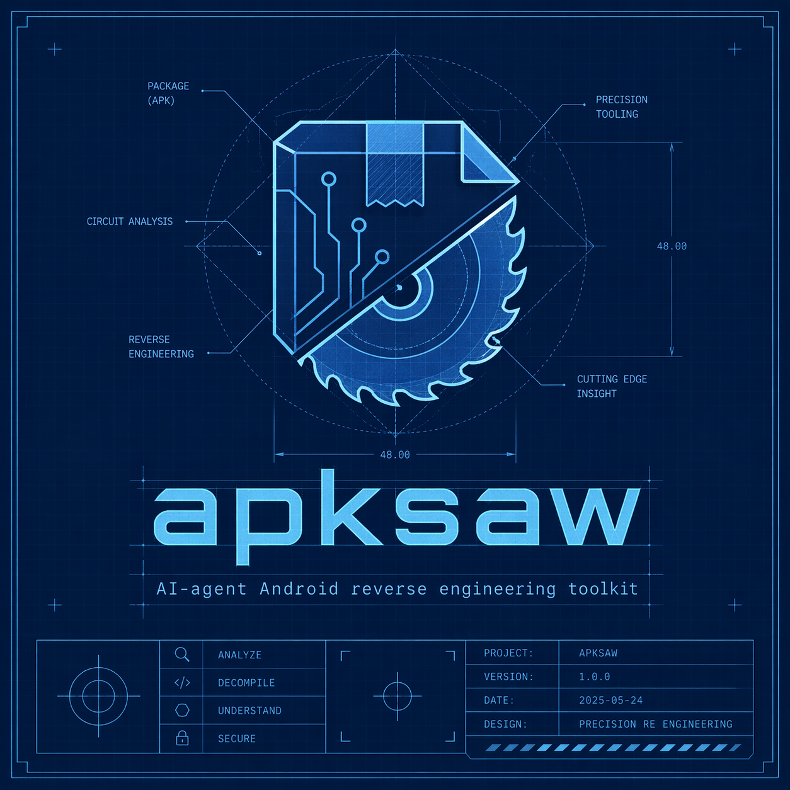

<p align="center">
  
</p>

<p align="center">
  <h1 align="center">apksaw</h1>
  <p align="center"><strong>AI-agent Android reverse engineering toolkit</strong></p>
  <p align="center">83 MCP tools. Plug into Claude Code and talk to APKs.</p>
</p>

<p align="center">
  <a href="#quick-start">Quick Start</a> &bull;
  <a href="#what-apksaw-does">What It Does</a> &bull;
  <a href="#case-studies">Case Studies</a> &bull;
  <a href="#all-tools">All Tools</a>
</p>

---

**apksaw** is an MCP server that gives AI agents the ability to reverse-engineer Android applications. It has 83 tools that fall into two categories:

**Infrastructure tools** give the agent hands. An AI can't read binary DEX bytecode — apksaw translates APKs into decompiled Java, cross-reference graphs, parsed manifests, and structured data that the agent can reason about. The agent does the thinking; the tool provides the data.

**Automation tools** do the work. The intent fuzzer generates 13 malformed payload variants per exported component, fires them via ADB, and monitors logcat for crashes — all in a single tool call. The security scanner checks for 50+ vulnerability patterns. The patch differ reverse-engineers what was fixed between two versions. These tools produce conclusions, not just raw data.

> **apksaw is a force multiplier, not a replacement for security expertise.** In real-world testing, the automated scanner produced a 65% false positive rate. Every finding had to be verified by decompiling the surrounding code and tracing data flow. apksaw makes that verification fast. It doesn't make it unnecessary.

---

## Quick Start

```bash
git clone https://github.com/trinity-cloud/apksaw.git
cd apksaw
uv sync

# Add to Claude Code
claude mcp add apksaw -- uv run --directory /path/to/apksaw apksaw
```

Restart Claude Code. All 83 tools appear automatically.

## What apksaw Does

### Automation — tools that do the work

These tools produce results, not just data. One tool call, structured output.

| Tool | What it does |
|---|---|
| `fuzz_exported_components` | Tests every exported activity/receiver/service with malformed intents (SQLi, path traversal, XSS, null bytes, oversized strings). Monitors logcat for crashes and ANRs. |
| `fuzz_deep_links` | 13 malformed URI variants per registered deep link scheme. Automated crash detection. |
| `fuzz_content_providers` | SQL injection and path traversal against exported ContentProviders. Detects data exposure. |
| `scan_all` | Runs 5 security scanners (manifest, crypto, network, injection, storage) and returns a combined severity report. |
| `scan_all_v2` | Enhanced scanners with taint analysis — checks argument values, verifies TrustManager bodies, traces reachability from exported components. Adds confidence levels. |
| `scan_yara` | 50 built-in YARA rules across 4 categories (credentials, crypto, obfuscation, suspicious behavior). |
| `extract_secrets` | Pattern-matched extraction of API keys, tokens, Firebase URLs, PEM keys, Bearer tokens, high-entropy strings. |
| `extract_api_endpoints` | Finds REST URLs, Retrofit annotations, OkHttp base URLs. Maps the full API surface. |
| `analyze_security_patches` | Compares two APK versions and identifies security-relevant fixes: unexported components, added pinning, removed dangerous APIs. |
| `find_vulnerability_window` | Reverse-engineers what vulnerability was patched. Generates PoC commands for the old version. |
| `extract_protobuf_schemas` | Reconstructs `.proto` definitions from generated Java classes. Maps all gRPC services and RPC methods. |
| `generate_ssl_bypass` | Analyzes the specific pinning implementation and generates a targeted Frida bypass script. |
| `generate_token_dumper` | Finds auth interceptors in the APK and generates Frida hooks to capture Bearer tokens. |
| `generate_crypto_hooks` | Generates Frida hooks for all Cipher, SecretKeySpec, and MessageDigest operations. |
| `detect_obfuscation` | Analyzes class naming patterns to identify obfuscator (R8, ProGuard, DexGuard) and confidence level. |
| `check_native_security` | Checks stack canary, NX, RELRO, PIE, Fortify on native `.so` libraries. |

### Infrastructure — tools that give the agent hands

These tools provide structured data that the agent interprets and reasons about.

**Device interaction:**
`device_info` | `list_packages` | `pull_apk` | `app_info` | `screenshot` | `install_apk` | `uninstall_app` | `force_stop` | `clear_app_data` | `monitor_logcat` | `start_activity` | `send_broadcast` | `get_runtime_info` | `take_screenshot`

**APK analysis:**
`load_apk` | `get_manifest` | `get_permissions` | `get_components` | `list_files` | `get_signing_info` | `check_certificate_security`

**Code navigation:**
`list_classes` | `get_class_info` | `list_methods` | `decompile_method` | `decompile_class` | `decompile_apk_full` | `search_strings` | `extract_urls` | `extract_interesting_strings` | `search_code`

**Cross-references:**
`get_xrefs_to` | `get_xrefs_from` | `get_call_graph` | `find_method_usage` | `find_api_calls` | `export_call_graph`

**Diffing:**
`diff_apks` | `diff_manifest` | `diff_classes` | `diff_strings` | `diff_security` | `find_patched_methods`

**Native analysis:**
`list_native_libs` | `analyze_native_lib` | `disassemble_function` | `search_native_strings`

**Multi-DEX:**
`list_dex_files` | `analyze_dex_boundaries` | `get_dex_class_map`

**Mapping:**
`load_mapping` | `deobfuscate_name`

**Other:**
`find_grpc_services` | `export_proto_file` | `find_auth_interceptors` | `generate_frida_hook` | `prepare_frida_apk` | `list_yara_rules` | `list_plugins` | Individual scanners (`scan_manifest_security` | `scan_crypto_issues` | `scan_network_security` | `scan_code_injection` | `scan_data_storage` | `scan_crypto_issues_v2` | `scan_network_security_v2` | `scan_code_injection_v2`)

## How It Works

```
You (natural language)
  |
  v
Claude Code
  |
  v
apksaw MCP Server (stdio)
  |
  +--> Androguard -----> DEX parsing, decompilation, cross-references
  +--> JADX ------------> High-quality Java decompilation
  +--> LIEF ------------> Native .so ELF analysis
  +--> Capstone --------> ARM/ARM64 disassembly
  +--> YARA ------------> Pattern-based detection
  +--> ADB -------------> Device interaction, APK extraction
```

## Examples

### Security audit in one shot
```
> Pull the app from my phone and run a full security scan.
  Then verify each finding by decompiling the relevant code.
```

### Fuzz for crashes
```
> Fuzz all exported components of com.example.app with malformed intents.
  If anything crashes, decompile the crashing component and find the bug.
```

### Hunt for zero-days via patch diffing
```
> I have v1.0 and v2.0 of this app. Find what security patches were applied
  in v2.0, then tell me what vulnerabilities exist in v1.0.
```

### Reverse-engineer the API
```
> Extract all protobuf schemas and gRPC services from this APK.
  Generate a .proto file I can use for API testing.
```

### Generate targeted Frida hooks
```
> Analyze how this app does SSL pinning, then generate a Frida script
  that bypasses it. Also generate hooks for all crypto operations.
```

## Case Studies

apksaw has been used in real security research. These case studies document findings, false positives, and the limits of automated analysis.

### [Hinge (co.hinge.app)](docs/case-studies/hinge-audit.md)

Match Group's dating app. Scanner produced 20 findings — **13 were false positives** (65%). Confirmed: exploitable Braze SDK key leaking 160 internal user attributes, unrestricted Google Geocoding key, deep link UI redress. The scanner found candidates; the agent verified them.

### [Kimi AI (com.moonshot.kimichat)](docs/case-studies/kimi-audit.md)

Moonshot AI's chat assistant. Scanner flagged 36 findings including a "critical WebView exploit." The agent discovered the WebView flag was actually `false` — scanner didn't check the boolean argument. Also found: disabled MCP server with no auth, hardcoded AES key, JiGuang TLS bypass, 12 third-party SDKs. The fuzzer ran 142 tests with zero crashes.

## Architecture

```
src/apksaw/
  server.py              # FastMCP server (stdio transport)
  config.py              # Paths and constants
  session.py             # Session management (in-memory + SQLite)
  db.py                  # SQLite persistence
  plugins.py             # Plugin discovery and loading
  tools/
    device.py            # ADB device interaction
    apk.py               # APK manifest and metadata
    dex.py               # Decompilation (Androguard + JADX)
    strings.py           # String extraction and pattern matching
    xrefs.py             # Cross-references and call graphs
    security.py          # Vulnerability scanning (v1)
    security_v2.py       # Enhanced scanning with taint analysis
    certificates.py      # APK signing analysis
    native.py            # Native .so analysis
    dynamic.py           # Runtime tools and Frida prep
    diff.py              # APK version comparison
    patch_analysis.py    # Security patch reverse-engineering
    fuzzer.py            # Intent fuzzing with crash detection
    frida_gen.py         # Frida script generation
    endpoints.py         # API endpoint discovery
    protobuf.py          # Protobuf/gRPC schema extraction
    yara_scan.py         # YARA rule scanning
    visualization.py     # Call graph export (Mermaid/DOT/JSON)
    mapping.py           # ProGuard/R8 deobfuscation
    multidex.py          # Multi-DEX analysis
  utils/
    adb.py               # ADB command wrapper
    common.py            # Shared helpers
    taint_lite.py        # Taint analysis for scanner v2
    bootstrap.py         # Auto-download JADX and apktool
    jadx.py              # JADX wrapper (single-class + full APK)
  rules/
    credentials.yar      # 14 rules
    crypto.yar           # 10 rules
    obfuscation.yar      # 11 rules
    suspicious.yar       # 15 rules
```

## Requirements

- Python 3.10+
- ADB installed and on `$PATH`
- Java 11+ (for JADX/apktool)
- A connected Android device or an APK file

JADX and apktool are **downloaded automatically** on first use to `~/.apksaw/tools/`.

## Philosophy

1. **Automation tools do the work.** The fuzzer, scanner, and patch differ produce actionable results in a single call. They don't require the agent to interpret raw data.

2. **Infrastructure tools give the agent hands.** Decompilation, cross-references, and string search provide the data the agent needs to verify findings and reason about code.

3. **Honest about limitations.** The scanner has a high false positive rate. The case studies document this. apksaw is the microscope, not the pathologist.

## License

MIT
